<h1 align="center">
  
</h1>

<h3 align="center"> Desarrollador Full Stack | Estudiante de Ingeniería de Software </h3>
<h4 align="center">📍 6° Semestre - Universidad Técnica de Ambato</h4>

<p align="center">
  
  
  
</p>

<div align="center">
  
</div>

---

##  Sobre mí


```javascript
const jonathan = {
    nombre: "Jonathan Josué Fiallos Yanza",
    ubicacion: "Ambato, Ecuador 🇪🇨",
    educacion: "Ingeniería de Software - UTA",
    semestre: "6° Semestre",
    pasiones: ["Desarrollo Web", "Backend", "Frontend", "Bases de Datos"],
    objetivo: "Convertirme en Full Stack Developer",
    estado: "Aprendiendo nuevas tecnologías "
};
```

• **Enfoque actual:** Desarrollo de aplicaciones web modernas y escalables  
• **Especialidades:** Frontend dinámico, backend robusto y arquitectura limpia  
• **Crecimiento:** Siempre explorando nuevos frameworks y mejores prácticas  
• **Filosofía:** Código limpio, soluciones creativas y aprendizaje constante

---

##  Stack Tecnológico

###  Lenguajes de Programación
<p align="center">
  
  
  
  
  
</p>

###  Frameworks & Libraries
<p align="center">
  
  
  
  
</p>

###  Frontend Development
<p align="center">
  
  
  
  
</p>

###  Databases & Backend
<p align="center">
  
  
  
  
</p>

###  Herramientas & DevOps
<p align="center">
  
  
  
  
  
  
    
</p>

###  Desktop Development
<p align="center">
  
  
  
</p>

###  API Development & Backend Services
<p align="center">
  
  
  
  
</p>

###  Reporting & Data Analysis
<p align="center">
  
  
  
  
</p>

---

##  Proyectos Destacados

<div align="center">

| Proyecto | Tecnologías | Descripción | Estado |
|----------|-------------|-------------|--------|
| 🌠**EventosUTA** |  | Sistema web para gestión de eventos universitarios | ⭠Activo |
| 🧠 **SistemaCompleto** |    | App web MVC con CRUD completo + APIs REST | ✅ Completo |
| 🮠**Tamagochi1** |   | Simulador con interfaz gráfica Java Swing + reportes | ✅ Completo |


</div>

### 🚀 Proyecto Destacado: EventosUTA
**Un sistema web moderno para la gestión de eventos universitarios**

```astro
---
// Desarrollado con Astro para máximo rendimiento
interface EventoProps {
  titulo: string;
  fecha: Date;
  ubicacion: string;
  descripcion: string;
}
---

<EventCard {evento} />
<style>
  /* Diseño responsive y moderno */
</style>
```

**Características principales:**
-  **Astro**: Generación estática ultra-rápida
-  **UI/UX moderno**: Interfaz intuitiva y responsive
- **Mobile-first**: Optimizado para todos los dispositivos
-  **Componentes reutilizables**: Arquitectura escalable

### 💼 Experiencia en Desarrollo Backend

**🔥 PHP & CRUD Operations**
```php
<?php
// Ejemplo de CRUD robusto implementado
class EventoController {
    public function create($data) {
        // Validación + inserción segura
        return $this->model->insert($data);
    }
    
    public function getAll() {
        // Paginación + filtros optimizados
        return $this->model->findWithPagination();
    }
    
    public function update($id, $data) {
        // Actualización con validaciones
        return $this->model->update($id, $data);
    }
    
    public function delete($id) {
        // Eliminación segura con verificaciones
        return $this->model->softDelete($id);
    }
}
?>
```

**☕ Java Swing & Desktop Development**
```java
// Aplicaciones de escritorio con NetBeans
public class TamagochiGUI extends JFrame {
    private JPanel panelPrincipal;
    private JButton btnAlimentar, btnJugar;
    private JLabel lblEstado, lblVida;
    
    public TamagochiGUI() {
        initComponents();
        generateReports(); // Integración con JasperReports
    }
    
    private void generateReports() {
        // Generación de reportes PDF/Excel
        ReportManager.createPDFReport(mascotaData);
    }
}
```

**🌐 API Development & Web Services**
- ✅ **REST APIs** con PHP y routing personalizado
- ✅ **Web APIs** con autenticación JWT
- ✅ **JSON responses** estructuradas y optimizadas
- ✅ **CRUD endpoints** con validaciones robustas
- ✅ **Database integration** con PDO y MySQLi

---

##  GitHub Analytics

<div align="center">
  
  
</div>

<div align="center">
  
  
</div>


---

##  Roadmap de Aprendizaje 2026

<div align="center">



</div>

```mermaid
graph TD
    A[🎓 Estado Actual] --> B[⚛️ React Avanzado]
    A --> C[🚀 Astro SSR]
    A --> D[☁️ Cloud Computing]
    B --> E[📱 React Native]
    C --> F[🔧 Microservicios]
    D --> G[🐳 Docker & Kubernetes]
    E --> H[🌟 Full Stack Expert]
    F --> H
    G --> H
```

###  Enfoque Actual
- 🌐 **React Ecosystem**: Hooks avanzados, Context API, Redux Toolkit
- 🚀 **Astro Advanced**: SSR, API Routes, Content Collections  
- ☁️ **Cloud Services**: AWS, Azure, deploy automation
- 🏗️ **Architecture**: Clean Architecture, SOLID principles
- 📱 **Mobile Development**: React Native, Expo
- 🔒 **Security**: JWT, OAuth, secure coding practices
- 🧪 **Testing**: Jest, Cypress, TDD methodology
- 🔧 **Backend Mastery**: PHP CRUD, REST APIs, Database Design
- 🖥️ **Desktop Apps**: Java Swing, JavaFX, NetBeans IDE
- 📊 **Reports & Analytics**: JasperReports, Crystal Reports, PDF generation

### Próximos Objetivos
- [ ] Certificación en AWS Cloud Practitioner
- [ ] Dominar TypeScript al 100%
- [ ] Contribuir a proyectos Open Source
- [ ] Crear mi primer SaaS con microservicios
- [ ] Mentor de estudiantes junior
- [ ] Especialización en Spring Boot + Java
- [ ] Desarrollo de APIs GraphQL

---

##  Conectemos y Colaboremos

<div align="center">

###  Formas de Contacto

[](mailto:josfia14@gmail.com)
[](https://www.linkedin.com/in/josue-fiallos/)
[](https://w.app/josu-f1)
[](https://t.me/@Josue_Fiallos)

</div>

### ¿En qué puedo ayudarte?

|  **Desarrollo** |  **Académico** |  **Proyectos** |
|:-:|:-:|:-:|
| Web Applications (PHP/React) | Tutorías de programación | Aplicaciones móviles |
| Backend APIs & CRUD | Proyectos universitarios | Sistemas web completos |
| Desktop Apps (Java Swing) | Debugging & Code Review | APIs REST robustas |
| Database Design & Reports | NetBeans & Visual Tools | Contribuciones OSS |

### ¿Qué busco?
- **Equipos de desarrollo** para proyectos innovadores
-  **Mentorías** en arquitectura de software
-  **Startups** para contribuir con código limpio
-  **Comunidades tech** para compartir conocimiento
-  **Ideas disruptivas** que cambien el mundo

---

##  Filosofía de Desarrollo

<div align="center">


---

###  Principios que Guían mi Código

```javascript
const principios = {
   calidad: 'Código limpio y mantenible',
   innovacion: 'Siempre buscando mejores soluciones',
   colaboracion: 'El conocimiento se multiplica al compartir',
   aprendizaje: 'Cada bug es una oportunidad de crecimiento',
   impacto: 'Tecnología que mejore vidas'
};
```

---

###  ¡Gracias por visitar mi perfil!


**"El mejor momento para plantar un árbol fue hace 20 años. El segundo mejor momento es ahora."**

🚀 Siempre programando, siempre aprendiendo, siempre creciendo...

</div>

<div align="center">
  
</div>
